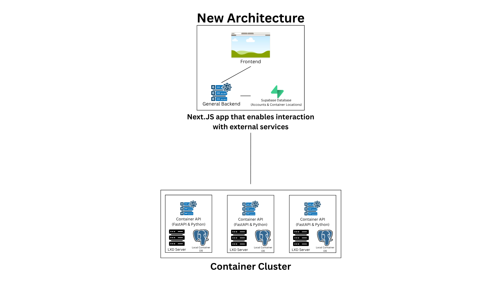

# ALUG@UCI Community Services
This repository contains the source code that enables ALUG@UCI to host remote containers that give members
the ability to host their own services open to the UCI community.

# Architecture

The website (/website) is a Next.JS app that contains the frontend that enables user interaction and a backend
that communicates with the different tenant nodes in the cluster and interacts with the database hosted on Supabase.

The Supabase database contains user accounts, login codes, nodes, and container requests. User accounts are only created when a container is provisioned and contain account status and container location. 

The Container API runs on each node to facilitate container interaction and provisioning via LXD and a PostgreSQL database holding container data, such as the SSH port and available forward ports.
